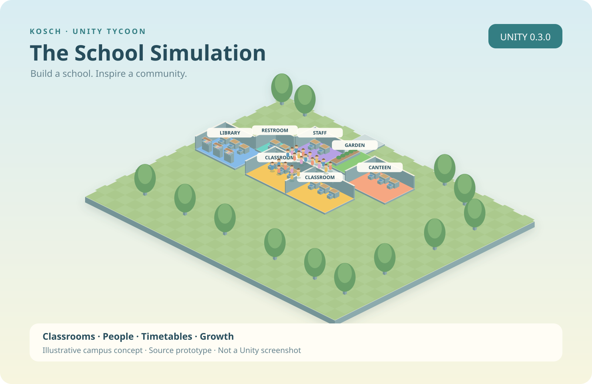

# 🏫 The School Simulation 0.2

**Baue eine kleine Schule zu einem lebendigen Campus aus.** Ein eigenständiger Schul-Tycoon in Unity mit isometrischer 3D-Ansicht, freundlicher Cartoon-Grafik und einer deutschen und englischen Oberfläche.

[GitHub](https://github.com/chekento/schooltycoon) · [Prüfungen](https://github.com/chekento/schooltycoon/actions) · [English](docs/README.en.md) · [Schnellstart](docs/QUICKSTART.de.md) · [Spielsysteme](docs/GAMEPLAY.md) · [Änderungen](CHANGELOG.md)

## Stand der ersten Umsetzung

Version **0.2.0 – Unity-Prototyp**. Das Repository enthält das vollständige Quellprojekt, eine Startszene, eigene prozedurale Raum- und Figurengrafik, Spiellogik, Tests und Build-Menüs. Es enthält noch **keine im Unity-Editor geprüfte Anwendung und keine fertige APK**. Der Unity-Editor war in der Entwicklungsumgebung nicht installiert; die C#-Simulation wurde separat kompiliert und getestet. Der genaue Prüfstand steht in [VALIDATION.md](docs/VALIDATION.md).

## Spielen

1. Projekt in **Unity Hub → Add project from disk** hinzufügen.
2. Mit **Unity 6.0, 6000.0.65f1** öffnen und Paketimport abwarten.
3. `Assets/Scenes/Campus.unity` öffnen, **Play** drücken.
4. Charakter, Haarfarbe und Namen wählen.
5. Rechts im Tab **Team** eine Lehrkraft einstellen. Links Bauwerkzeuge auswählen.
6. Auf **Start** klicken oder mit **Tag beenden** einen Schultag abrechnen.

Der Campus beginnt mit einem Flur, einem Klassenraum, **18 Schülern und 16.000 €**. Du startest in der Planungspause. Eine Lehrkraft wird gebraucht, bevor die 24 Unterrichtsplätze betreut sind.

## In Version 0.2.0 enthalten

- Isometrischer Campus mit frei verschiebbarer Kamera, Zoom und Drehung.
- Charakterdesigner in drei Schritten und sichtbare Schulleitung auf dem Campus.
- Zehn Bautypen mit Preis, Größe, Bauvorschau, Drehung, Fluranschluss und Rückbau.
- Unterrichtsplätze entstehen aus Klassenräumen **und** Lehrkräften.
- Tagesaktuelle Bewerbungen, Lehrkräfte, Hausdienst und Schulberatung.
- Sechs Unterrichtsblöcke mit fünf Fächern und passenden Raum-Boni.
- Fördergelder, Mensaerlöse, Gehälter, Betriebskosten und Lernmaterialbudget.
- Zufriedenheit, Sauberkeit, Lernerfolg und Ansehen beeinflussen die Entwicklung.
- Sieben Förderziele, drei wiederkehrende Ereignisse mit jeweils drei Entscheidungen.
- 20×16 Baufelder zu Beginn; Grundstückserweiterung auf 32×24 Felder.
- Laufende Figuren mit Flurwegen, Unterricht, Mittagspause und Gartenzeit.
- Deutsch / Englisch, Touchsteuerung und Berücksichtigung der sicheren Bildschirmfläche.
- Automatisches lokales Speichern nach Änderungen, Tagesende und App-Pause; Sicherung und geprüfte Wiederherstellung.
- Build-Menüs für Windows, Linux, Android und WebGL; automatisierbare Prüfungen auf GitHub.

## Steuerung

| Aktion | Desktop | Touch |
| --- | --- | --- |
| Raum bauen / auswählen | Klick auf ein Baufeld | Baufeld antippen |
| Kamera verschieben | Ziehen, WASD oder Pfeiltasten | Mit einem Finger ziehen |
| Zoom | Mausrad oder − / + | Pinch oder − / + |
| Raum drehen | R oder „Drehen“ | „Drehen“ |
| Kamera drehen | Q / E oder „Ansicht“ | „Ansicht“ |
| Bauwerkzeug verlassen | Esc oder „Erkunden“ | „Erkunden“ |
| Zeit anhalten / starten | Leertaste oder „Start/Pause“ | „Start/Pause“ |

## Räume

| Raum | Größe | Einmalig | Pro Tag | Freischaltung |
| --- | --- | ---: | ---: | --- |
| Flur | 1×1 | 80 € | 1 € / Feld | Sofort |
| Klassenzimmer | 4×3 | 3.600 € | 36 € | Sofort |
| Sanitärraum | 2×2 | 1.100 € | 14 € | Sofort |
| Lehrerzimmer | 3×2 | 1.800 € | 18 € | Sofort |
| Schulgarten | 3×3 | 800 € | 5 € | Sofort |
| Mensa | 4×3 | 3.000 € | 30 € | Förderziel 2 |
| Bibliothek | 4×3 | 4.800 € | 35 € | Förderziel 2 |
| Labor | 4×3 | 6.500 € | 45 € | Förderziel 4 |
| Atelier | 4×3 | 5.200 € | 34 € | Förderziel 4 |
| Sporthalle | 5×4 | 9.000 € | 60 € | Förderziel 6 |

Räume müssen direkt an einen Flur grenzen, der zum Eingang führt. Ein Rückbau zahlt die Hälfte der Baukosten zurück. Startflur und erstes Klassenzimmer bleiben erhalten; benötigte Verbindungsflure können nicht entfernt werden.

## Architektur

| Bereich | Aufgabe |
| --- | --- |
| `Assets/SchoolTycoon/Core` | Engineunabhängige C#-Simulation, Regeln, Finanzen und Wegsuche |
| `Assets/SchoolTycoon/Runtime` | Unity-Ansicht, Kamera, Figuren, Menüs und Speichern |
| `Assets/SchoolTycoon/Resources` | Eigener mitgelieferter Campus-Shader |
| `Assets/SchoolTycoon/Editor` | Build-Befehle und Szenenmenü |
| `Assets/SchoolTycoon/Tests/EditMode` | Tests für Finanzen, Bau, Wege, Speicherung und Fortschritt |
| `tools` | Prüfungen ohne Unity-Editor |

Grafik entsteht zur Laufzeit aus eigenen Formen; kostenpflichtige Assets werden nicht benötigt. Das Projekt verwendet die **Built-in Render Pipeline**, uGUI und den klassischen Input Manager. Die Startszene wird im Play-Modus durch `SchoolApp` aufgebaut.

## Builds und GitHub

**School Simulation → Build → Windows / Linux / Android APK / WebGL**. Das passende Build-Modul muss in Unity Hub installiert sein. Für Android werden SDK, NDK, OpenJDK und IL2CPP benötigt. Ausgabe: `Builds/Android/TheSchoolSimulation-0.2.0.apk`.

`Simulation checks` führt nach Push oder Pull Request die strukturellen Prüfungen und dieselben Domain-Tests mit .NET 8 aus. Der manuelle Workflow `Unity build (licensed runner)` verwendet einen selbst gehosteten, aktivierten Unity-Runner mit dem Label `unity` und der Umgebungsvariable `UNITY_EDITOR`. Er setzt einen solchen Runner voraus und startet keinen unbeaufsichtigten Cloud-Build ohne Editor.

## Nächste Ausbaustufen

Individuelle Schülerprofile und Klassen, Personalzuordnung pro Raum, Unterrichtsanimationen, Forschung, größere Karten, Jahreszeiten, Audio und eine am Gerät getestete Android-Veröffentlichung. Die aktuelle Figurenansicht ist eine vereinfachte Darstellung der Simulation; Figuren vermeiden Räume über die Flurwege, besitzen aber noch keine gegenseitige Kollisionsvermeidung.

Konzept: **KoSch / The School Simulation**. Bezug auf das ausgewählte School-Simulation-Plugin; eigenständige Umsetzung in Unity. Noch keine Veröffentlichungslizenz gewählt. Unity und Unity-Pakete behalten ihre jeweiligen Bedingungen.
